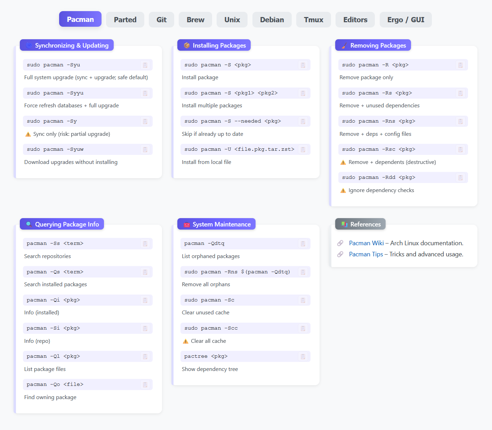

# Cheatsheet Commander

**Cheatsheet Commander** is a sleek, all-in-one command-line reference designed for speed and convenience. This self-contained HTML file acts as a fast, offline-first cheatsheet for essential tools like Git, Pacman, Parted, and the Unix shell.

Because it's a single file, it runs entirely locally in your web browser—no server, no installation, and no internet connection required. Just save it, open it, and bookmark it for instant access to the commands you need, right when you need them.

---

## 🚀 Quick Start

1. Save the HTML file to your computer (e.g., `cheatsheet.html`).
2. Open the file in your preferred web browser.
3. Bookmark it for one-click access.
4. *(Optional)* Add a `commander.png` file to the same folder for a custom icon.

---

## ✨ Features

* **All-in-One Reference** — Covers essential command-line tools in one place.
* **Offline-First** — Works without an internet connection.
* **Zero Setup** — No installation, servers, or dependencies.
* **Instant Access** — Opens locally and loads immediately.
* **Clean UI** — Modern, responsive, and easy to navigate.

---

## 📌 Use Cases

* Quick lookup for frequently used commands
* Offline environments or restricted networks
* System recovery or live USB usage
* Learning and reinforcement of CLI workflows

---

## 🧠 Philosophy

Cheatsheet Commander is built around **speed, locality, and reliability**. By eliminating dependencies and external calls, it ensures that your reference material is always available, predictable, and fast.

---
## 📜 License

Cheatsheet Commander © 2025 Ethan Kelley (@pullclone) is licensed under the Apache License, Version 2.0.

This means you are free to use, modify, distribute, and build upon this project—even in commercial environments—provided that you include the appropriate license and attribution.

See the LICENSE file for full details.

---

### 🔄 License Transition Note

Versions prior to this release were licensed under CC BY-NC-ND 4.0.  
As of this version, Cheatsheet Commander is released under Apache 2.0 to support broader use, modification, and integration.
