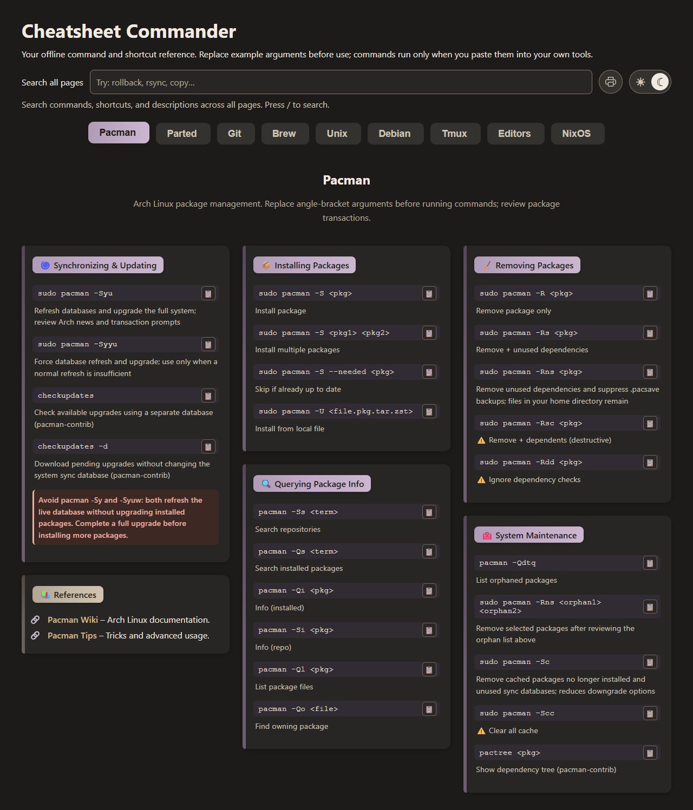

# Cheatsheet Commander

**Cheatsheet Commander** is an offline command and keyboard-shortcut reference in a single HTML file. It covers Pacman, GNU Parted, Git, Homebrew, Unix/Linux shell tools, Debian/APT, tmux, Emacs, Vim/Evil, Micro, nano, NixOS/Nix, Engram-en, and Kate.

## Quick start

1. Download [Cheatsheet-Commander.html](Cheatsheet-Commander.html), or clone this repository.
2. Open the HTML file in a current browser. No server or installation is required.
3. Optionally keep `commander.png` beside the HTML file for its browser icon.
4. Bookmark the file. A page fragment such as `#git` opens that tab directly.

The reference, search, and page navigation work offline. Source links open external documentation and require a connection. With JavaScript disabled, all pages remain readable and browser Find still works.

## Using the reference

- **Search all pages:** search commands, shortcuts, or descriptions. Each tab shows its matching card count. Multiple search words must all occur in a card. Press `/` to focus search and Escape to clear it.
- **Navigate by keyboard:** focus the selected tab, then use Left/Right, Home, or End. Browser Back and Forward restore previous tabs.
- **Copy commands:** use the clipboard button beside a command or configuration snippet. Multiline snippets preserve line breaks. If automatic copying is blocked, a dialog offers selected text for manual copying. Keyboard shortcuts are meant to be pressed in their editor, so they have no command-copy button.
- **Choose a theme:** System follows your device appearance; Light and Dark override it. Your choice is saved in this browser when storage is available.
- **Responsive cards:** cards fill the shortest available column in wider views, and stack in reading order on small screens.
- **Print:** Print page prints the selected page and any active search filter. Clear search first to print the entire page.

Replace sample arguments such as `<pkg>`, `<branch>`, `host`, and `/dev/sdX` before running commands. The app does not execute commands. Each page identifies relevant platforms, command contexts, or configuration prerequisites. Parted commands run at its prompt unless marked as shell commands; the Unix examples assume a POSIX-style shell. Editor shortcuts describe defaults unless marked as suggested mappings.

Official reference links appear on every page. Check your installed tool's help when working with an older version or custom keybindings.

## License

Cheatsheet Commander © 2025 Ethan Kelley (@pullclone) is licensed under the Apache License, Version 2.0.

See [LICENSE](LICENSE) and [NOTICE](NOTICE) for the license and attribution.

### License transition note

Versions prior to this release were licensed under CC BY-NC-ND 4.0. As of this version, Cheatsheet Commander is released under Apache 2.0 to support broader use, modification, and integration.
